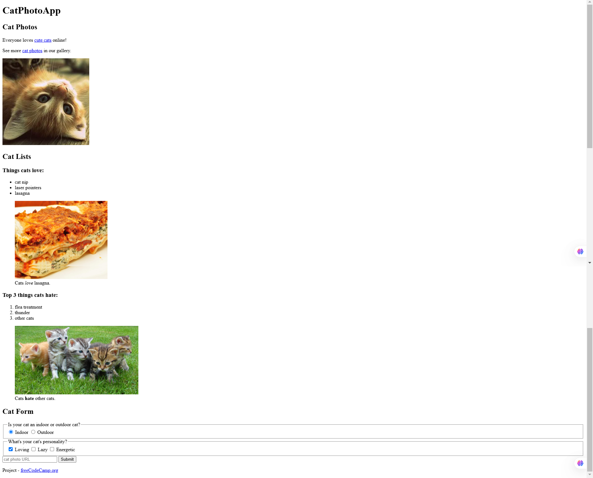

# **Learn HTML by Building a Cat Photo App** (FreeCodeCamp)

Welcome to the **Learn HTML by Building a Cat Photo App** project from **FreeCodeCamp**! This project is designed to teach you the basics of **HTML** by guiding you through creating a simple cat photo app.

---

## 📝 **Project Overview**

This project allows you to:
- Learn fundamental **HTML** elements and structure.
- Work with **tags**, **attributes**, and **semantic elements**.
- Build a simple **cat photo app** as a hands-on learning experience.
- Gain confidence in writing clean and structured **HTML** code.

This project is a part of **FreeCodeCamp's** curriculum and aims to teach beginners how to build structured web pages using **HTML**.

---

## 📂 **Table of Contents**

1. [Installation](#installation)
2. [Usage](#usage)
3. [How It Works](#how-it-works)
4. [Technologies Used](#technologies-used)
5. [Output Screenshot](#output-screenshot)
6. [Contributing](#contributing)

---

## ⚙️ **Installation**

To run the **Learn HTML by Building a Cat Photo App** project locally:

1. **Clone** the repository:
   ```bash
   git clone https://github.com/harshikab2112/Learn-HTML-by-Building-a-Cat-Photo-App.git
   ```

2. **Navigate** to the project directory:
   ```bash
   cd Learn-HTML-by-Building-a-Cat-Photo-App
   ```

3. **Open** the `index.html` file in your browser or code editor.

---

## 🚀 **Usage**

This project provides a step-by-step approach to building a simple **cat photo app** using only **HTML**. You will be adding different HTML elements to construct the page as you progress.

---

## 🔍 **How It Works**

1. **HTML Basics**:
   - Learn about **headings, paragraphs, lists, images, and links**.
   
2. **Building the Structure**:
   - Use **divs, sections, and semantic tags** to structure the webpage.
   
3. **Adding Images and Links**:
   - Implement the `` tag to display cat images and the `<a>` tag to link external resources.

4. **Final Touches**:
   - Use **HTML best practices** to ensure a well-structured and readable document.

---

## 🛠️ **Technologies Used**

- **HTML** (for structuring the web page)
- **Semantic Elements** (to improve accessibility and readability)

---

## 📸 **Output Screenshot**
-Here’s a screenshot of the final cat photo app:<br>
-

---

## 🤝 **Contributing**

Contributions are welcome! If you would like to contribute, please follow these steps:

1. **Fork** the repository.
2. Create a **new branch**.
3. Implement your changes.
4. Create a **pull request** with a description of what you’ve changed.

---

### **Author**  
**Harshika Bansal**  
GitHub: [harshikab2112](https://github.com/harshikab2112)

---

### 🖤 **Thank You for Checking Out the Project!**

---
